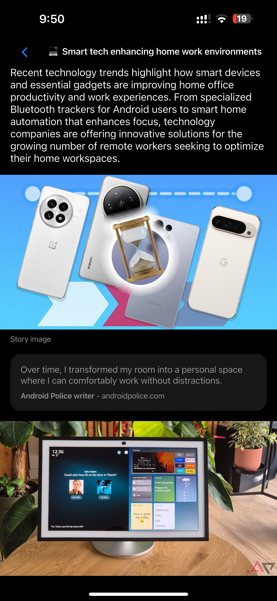
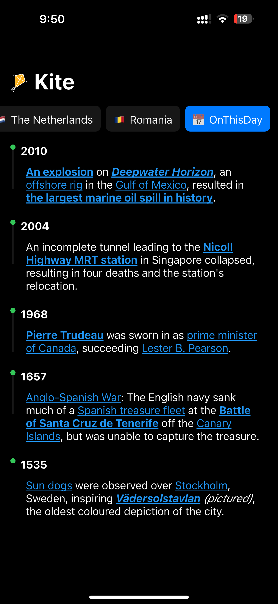

# Kite

A Kite Flutter news reader application powered by Riverpod and Cupertino widgets, featuring offline caching, pull-to-refresh, and an "On This Day" events view.

## Prerequisites

- Flutter SDK (>= 3.0.0)
- Dart >= 2.17.0

## Getting Started

   ```
1. Install dependencies:
   ```bash
   flutter pub get
   ```
2. Generate Riverpod and other code (if needed):
   ```bash
   dart run build_runner build --delete-conflicting-outputs
   ```
3. Run the app on an emulator or connected device:
   ```bash
   flutter run
   ```

## Running Tests

Execute all unit and widget tests:
```bash
flutter test
```

## Screenshots

<!-- Replace these with actual screenshots in `screenshots/` folder -->

| Feed Screen             | Article Detail Screen  | On This Day Screen     |
| ----------------------- | ---------------------- | ---------------------- |
|  |  |  |

## Project Structure

```
lib/         # Application source
  models/    # Data models (Category, News, OnThisDay)
  providers/ # Riverpod providers and code-gen annotations
  services/  # API client, URLs, storage wrapper
  widgets/   # Reusable UI components
  screens/   # Main screens (Feed, Article Detail, OnThisDay)
  extensions/# Helper extensions for emoji mapping
test/        # Unit and widget tests
```
